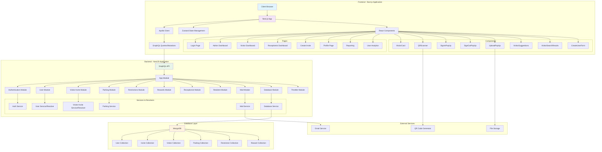
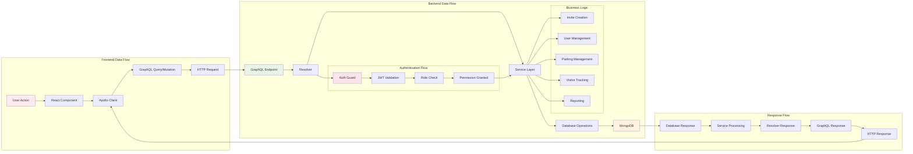
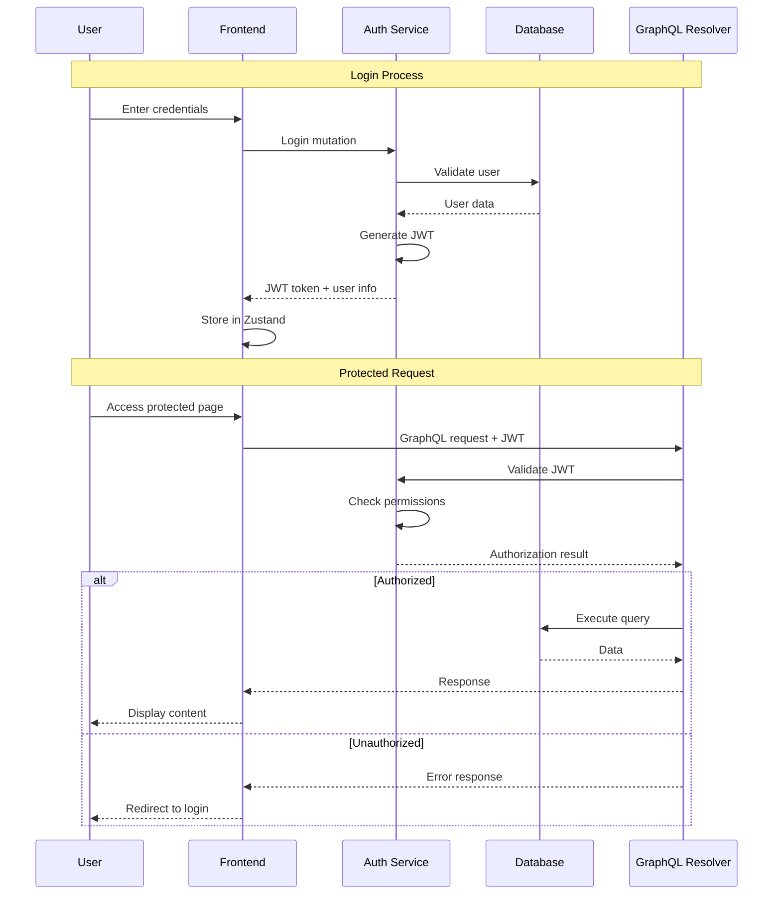
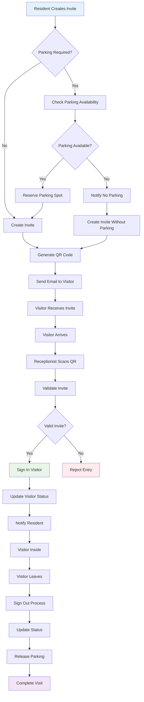
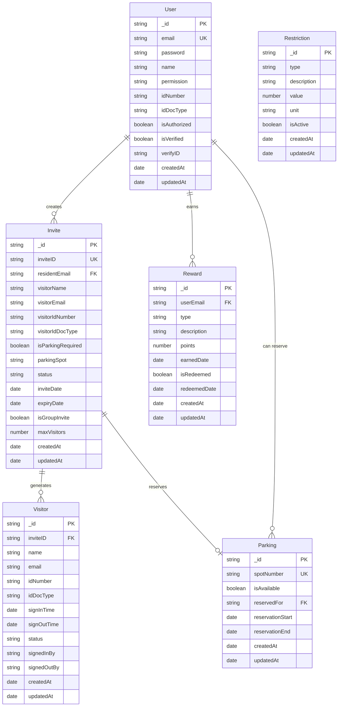
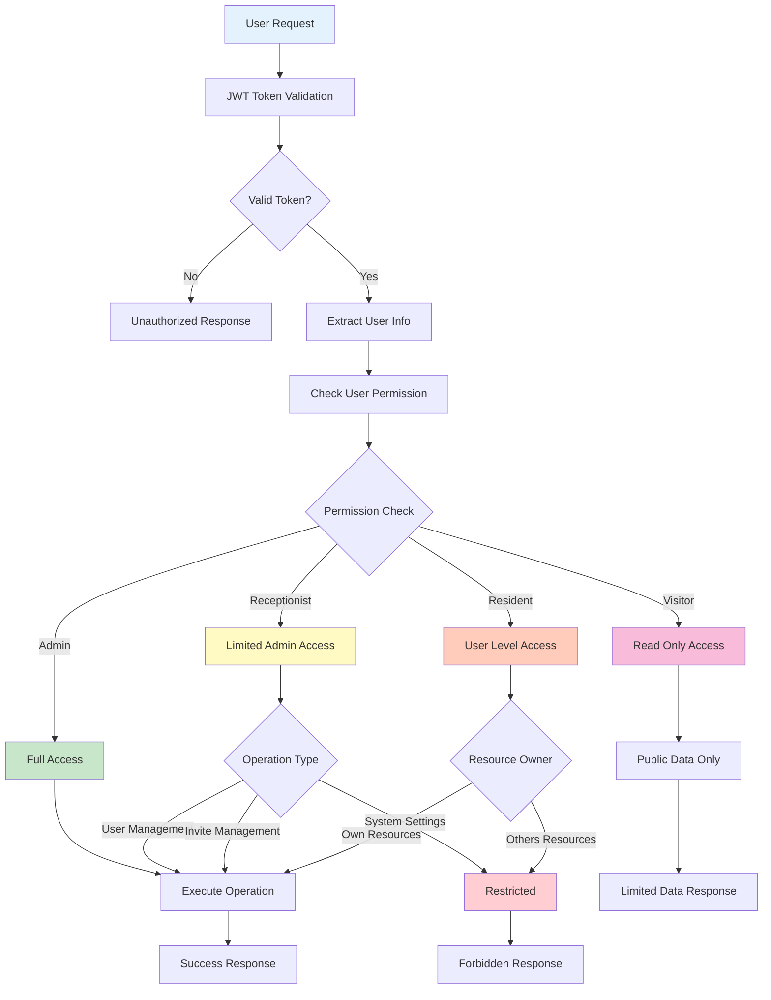
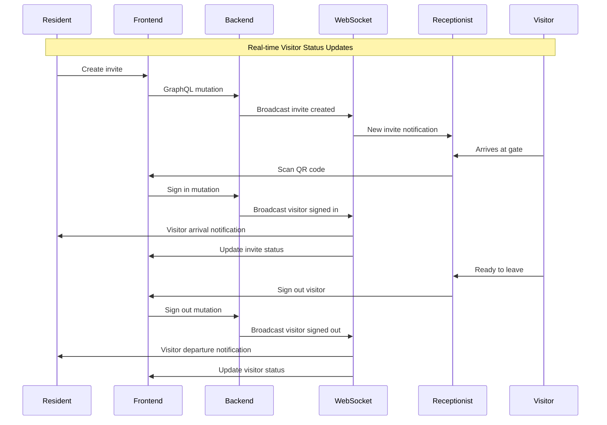
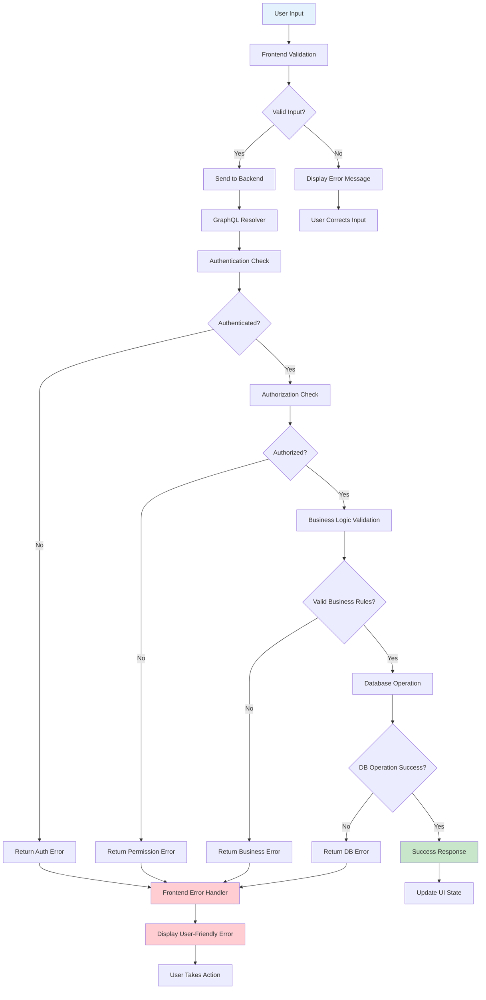

# Intelligent VMS - Comprehensive System Diagrams

## 1. System Architecture Overview

## 2. Data Flow Architecture

## 3. User Authentication & Authorization Flow

## 4. Visitor Management Workflow

## 5. Component Interaction Diagram

```mermaid
graph TB
    subgraph "Admin Dashboard Components"
        A1[AdminDashboard] --> A2[User Management]
        A1 --> A3[System Settings]
        A1 --> A4[Analytics Charts]
        A1 --> A5[Parking Management]
        A1 --> A6[Restrictions Management]
    end
    
    subgraph "Visitor Dashboard Components"
        B1[VisitorDashboard] --> B2[Active Invites]
        B1 --> B3[Create Invite Button]
        B1 --> B4[Visitor History]
        B1 --> B5[Profile Settings]
        B2 --> B6[VisitorCard]
        B6 --> B7[QR Code Display]
        B6 --> B8[Visitor Details]
    end
    
    subgraph "Receptionist Dashboard Components"
        C1[ReceptionistDashboard] --> C2[QR Scanner]
        C1 --> C3[Pending Invites]
        C1 --> C4[Sign In/Out Forms]
        C2 --> C5[Camera Interface]
        C3 --> C6[Invite Validation]
        C4 --> C7[Visitor Processing]
    end
    
    subgraph "Shared Components"
        D1[Layout] --> D2[Navigation]
        D1 --> D3[Header]
        D1 --> D4[Footer]
        D5[AlertProvider] --> D6[Notifications]
        D7[AuthCard] --> D8[Login Form]
        D9[CreateUserForm] --> D10[User Registration]
    end
    
    subgraph "State Management"
        E1[AuthStore] --> E2[User Session]
        E1 --> E3[Permissions]
        E1 --> E4[Navigation Links]
        E5[Apollo Cache] --> E6[GraphQL Data]
    end
    
    A1 --> D1
    B1 --> D1
    C1 --> D1
    D8 --> E1
    B3 --> F1[CreateInvite Page]
    C2 --> F2[Invite Validation]
    
    style A1 fill:#ffecb3
    style B1 fill:#c8e6c9
    style C1 fill:#f8bbd9
    style E1 fill:#e1bee7
```

## 6. Database Schema Relationships

## 7. GraphQL API Structure

```mermaid
graph TB
    subgraph "GraphQL Schema"
        A[Query Type] --> B[User Queries]
        A --> C[Invite Queries]
        A --> D[Visitor Queries]
        A --> E[Parking Queries]
        A --> F[Analytics Queries]
        
        G[Mutation Type] --> H[User Mutations]
        G --> I[Invite Mutations]
        G --> J[Visitor Mutations]
        G --> K[Parking Mutations]
        G --> L[Auth Mutations]
        
        subgraph "User Operations"
            B --> B1[searchUser]
            B --> B2[getUnauthorizedUsers]
            B --> B3[helloUser]
            H --> H1[signup]
            H --> H2[verify]
            H --> H3[deleteUserAccount]
            H --> H4[authorizeUserAccount]
        end
        
        subgraph "Invite Operations"
            C --> C1[getInvites]
            C --> C2[getInvite]
            C --> C3[getVisitors]
            C --> C4[getInviteSuggestions]
            I --> I1[createInvite]
            I --> I2[updateInvite]
            I --> I3[deleteInvite]
            I --> I4[bulkSignIn]
        end
        
        subgraph "Authentication"
            L --> L1[login]
            L --> L2[logout]
            L --> L3[refreshToken]
        end
        
        subgraph "Analytics"
            F --> F1[getTotalNumberOfVisitors]
            F --> F2[getNumInvitesPerDate]
            F --> F3[getPredictedInviteData]
            F --> F4[getUsedParkingsInRange]
        end
    end
    
    subgraph "Resolvers"
        M[UserResolver] --> B & H
        N[VisitorInviteResolver] --> C & I
        O[AuthResolver] --> L
        P[ParkingResolver] --> E & K
        Q[AnalyticsResolver] --> F
    end
    
    style A fill:#e3f2fd
    style G fill:#f3e5f5
    style M fill:#e8f5e8
```

## 8. Security & Permission Model

## 9. Real-time Features & WebSocket Flow

## 10. Error Handling & Validation Flow

This comprehensive set of Mermaid diagrams covers all major aspects of the Intelligent VMS system, providing detailed visualization of the architecture, data flow, user interactions, and technical implementation details.